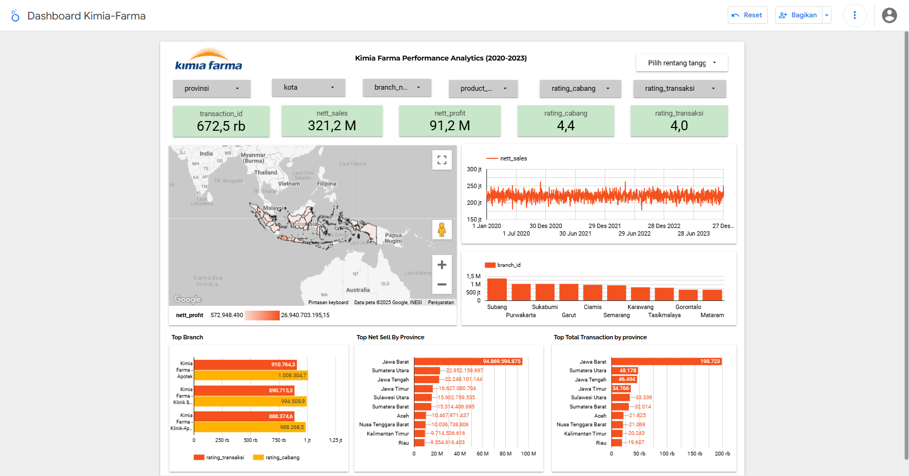

# Kimia Farma Sales Dashboard
Tools: <br>
👩🏻‍💻 Visual Studio Code <br>
👩🏻‍💻 Big Query <br>
🗂️ GitHub <br>
📊 Google Looker Studio

## Project Background 
Kimia Farma is the first pharmaceutical industry company in Indonesia which was founded by the Dutch East Indies Government in 1817. As a Big Data Analyst Intern who already understands the sales data for each Brand at Kimia Farma, I was asked to make a dashboard of sales data in one year from the raw data that has been provided. To test my understanding, it is necessary to process the data from beginning to end.

## Objective
* The task is to evaluate business performance from 2020 to 2023 through comprehensive data analysis. 
* This project involves analyzing transaction data, inventory management, branch operations, and product information to derive meaningful insights that can inform business decisions.

##  Understanding Data
### Dataset Overview :
* The project utilizes four primary datasets:
    1. `kf_final_transaction.csv` - Contains transaction records
    2. `kf_inventory.csv` - Inventory management data
    3. `kf_kantor_cabang.csv` - Branch office information
    4. `kf_product.csv` - Product catalog and details

##  Develop analysis tables
table analisis query
```sql
WITH 
-- CTE untuk menghitung persentase laba berdasarkan harga produk
profit_calculation AS (
    SELECT 
        product_id,
        price,
        CASE
            WHEN price <= 50000 THEN 0.10
            WHEN price <= 100000 THEN 0.15
            WHEN price <= 300000 THEN 0.20
            WHEN price <= 500000 THEN 0.25
            ELSE 0.30
        END AS persentase_gross_laba
    FROM `dataset_kimiafarma.product`
),

-- CTE untuk menggabungkan semua data transaksi dengan informasi terkait
transaction_base AS (
    SELECT 
        t.*,
        b.branch_name,
        b.kota,
        b.provinsi,
        b.rating as rating_cabang,
        p.product_name,
        p.price as actual_price,
        pm.persentase_gross_laba
    FROM `dataset_kimiafarma.transaction` t
    LEFT JOIN `dataset_kimiafarma.branch` b ON t.branch_id = b.branch_id
    LEFT JOIN `dataset_kimiafarma.product` p ON t.product_id = p.product_id
    LEFT JOIN profit_calculation pm ON t.product_id = pm.product_id
)

-- Query utama untuk menampilkan hasil analisis
SELECT 
    transaction_id,
    CAST(date AS DATE) as date,
    branch_id,
    branch_name,
    kota,
    provinsi,
    rating_cabang,
    customer_name,
    product_id,
    product_name,
    actual_price,
    discount_percentage,
    persentase_gross_laba,
    ROUND(actual_price * (1 - discount_percentage), 2) as nett_sales,
    ROUND(actual_price * (1 - discount_percentage) * persentase_gross_laba, 2) as nett_profit,
    rating as rating_transaksi
FROM transaction_base
ORDER BY date;
```
## Dashboard Visualization
Visualization Dashboard for this analysis can be accessed at [Kimia Farma Analytics Dashboard](https://lookerstudio.google.com/s/hoEUVKfTWD8). 

## Key Findings

### Overall Performance
- Total Profit: Rp 98.5M
- Total Sales: Rp 347.0M
- Total Transactions: 672.5K

### Geographic Analysis
1. Top Performing Provinces:
   - Jawa Barat (Leading with Rp 29.1M profit)
   - Sumatera Utara (Rp 7M)
   - Jawa Tengah (Rp 6.8M)
   - Jawa Timur (Rp 5.1M)
   - Sulawesi Utara (Rp 4.9M)

2. Top 5 Performing Cities:
   - Subang
   - Garut
   - Purwakarta
   - Semarang
   - Ciamis

### Yearly Performance
- Consistent profit trends from 2020-2023
- Annual profit ranging between Rp 24.5M - 24.8M

### Branch Types Performance
Three categories with distinct performance patterns:
- Kimia Farma - Apotek
- Kimia Farma - Klinik & Apotek
- Kimia Farma - Klinik-Apotek-Laboratorium

## Technical Requirements
- Google Cloud Platform account
- BigQuery access
- Access to Looker Studio (formerly Google Data Studio)
