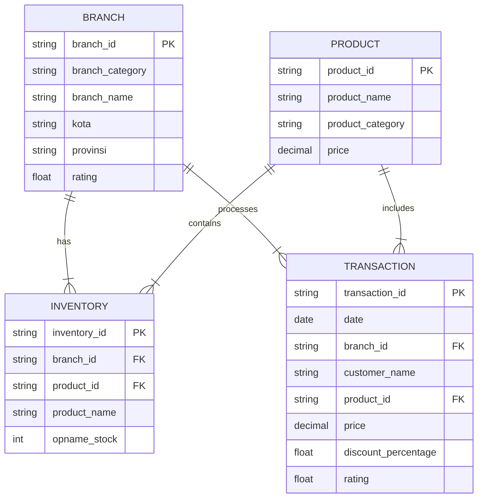

# Sales Performance Dashboard
Tools:  
👩🏻‍💻 Visual Studio Code  
👩🏻‍💻 PostgreSQL  
🗂️ GitHub  
📊 Google Looker Studio

## Project Background 
Kimia Farma is the first pharmaceutical industry company in Indonesia which was founded by the Dutch East Indies Government in 1817. As a Big Data Analyst Intern who already understands the sales data for each Brand at Kimia Farma, I was asked to make a dashboard of sales data in one year from the raw data that has been provided. To test my understanding, it is necessary to process the data from beginning to end.

## Stage 01 : Understanding Data
### Dataset Overview :
* The project utilizes four primary datasets:
    1. `kf_final_transaction.csv` - Contains transaction records
    2. `kf_inventory.csv` - Inventory management data
    3. `kf_kantor_cabang.csv` - Branch office information
    4. `kf_product.csv` - Product catalog and details

* kf_final_transaction.csv dapat dikategorikan sebagai fact table, fact table adalah tabel yang berisi data transaksi atau kejadian yang dapat diukur.
* Dataset lainya dapat dikategorikan sebagai dimensional table, dimensional tabel yang berisi data deskriptif yang memberikan konteks pada data di Fact Table.
* Pengkategorian Fact table dan Dimensional table memiliki keuntungan yaitu :
    1. membantu Optimasi Partitioning dan Clustering
    2. meningkatkan Konsistensi 
    3. Kemudahan Analisis

### Entity Relationship Diagram (ERD)

## Stage 02: Preparing Data
